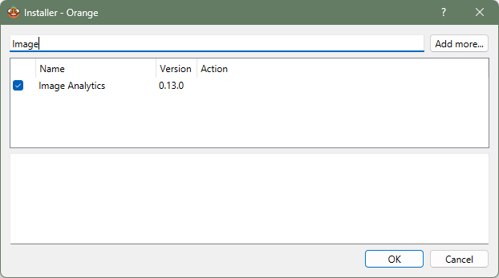

# Introducción a la Inteligencia Artificial con Orange 🍊

Este repositorio contiene los materiales de un taller introductorio sobre Inteligencia Artificial (IA) dirigido a estudiantes de educación secundaria. El taller utiliza la herramienta visual [Orange Data Mining](https://orangedatamining.com/) para que los alumnos y alumnas puedan explorar conceptos de IA sin necesidad de programar.

## ✅ Antes del taller

### 🔧 ¿Qué necesitas tener preparado?

Para poder participar activamente en el taller, asegúrate de tener lo siguiente **instalado y listo antes del día del curso**:

### 1. 🟠 Instalar Orange

Descarga e instala la aplicación Orange desde su web oficial:  
👉 https://orangedatamining.com/download/

- Selecciona la versión adecuada para tu sistema operativo (Windows, macOS, etc.).
- Instálala como cualquier otro programa.
- Una vez instalado, **abre Orange una vez para comprobar que funciona**.

### 2. 🧩 Instalar los complementos (Add-ons)

Este taller requiere una extensión (add-on) dentro de Orange.

#### 📌Image Analytics (para trabajar con imágenes)

1. Abre Orange
2. Ve a la barra de menú superior:  
   `Options > Add-ons`
3. Busca **Image Analytics** en la lista y márcalo (siguiente captura)

4. Haz clic en **OK** para instalarlo
5. **Cierra y vuelve a abrir Orange**

Una vez hecho esto, ya puedes participar en el taller!

---
## 📁 Contenido

- `flujos/`: Archivos `.ows` con los flujos de Orange utilizados en cada mini-proyecto.
- `guias/`: Instrucciones paso a paso para replicar cada proyecto dentro de Orange.
- `presentacion/`: Diapositivas utilizadas durante el taller.
- `imagenes/`: Capturas de pantalla opcionales para acompañar las guías.

---

## 🧪 Mini-proyectos incluidos

### 🩺 1. Clasificación de tumores (Breast Cancer Wisconsin)
> Un modelo de IA que predice si un tumor es benigno o maligno a partir de datos clínicos. Ideal para introducir la clasificación, los árboles de decisión y la evaluación de modelos.

### 🔬 2. Agrupamiento de imágenes de curación ósea (Bone Healing)
> Proyecto basado en imágenes microscópicas del proceso de cicatrización ósea. Se exploran técnicas no supervisadas como *t-SNE* y *k-means* para descubrir patrones visuales sin usar etiquetas.

---
## 🤝 Contribuciones
Las contribuciones están más que bienvenida. Este repositorio busca servir como recurso abierto y útil para docentes, investigadores y personas interesadas en introducir la IA en entornos educativos.

---

## 📚 Licencia

Este material se distribuye bajo la licencia MIT.

---

## 📇 Cómo citar este recurso

Pending.
---

