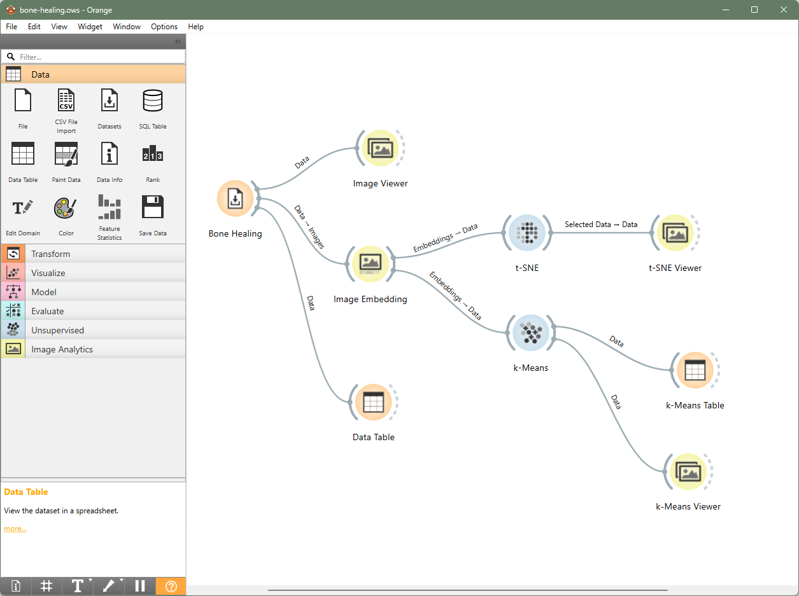

# 🔬 Mini-proyecto 2: Agrupamiento de imágenes de curación ósea (Bone Healing)

Este mini-proyecto tiene como objetivo explorar el uso de la IA para **agrupar imágenes biológicas** sin etiquetas previas, utilizando técnicas de **aprendizaje no supervisado**. Usaremos imágenes de microscopía del proceso de curación ósea (fractura) y veremos cómo la IA puede detectar similitudes visuales automáticamente.

## 🎯 ¿Qué aprenderás?

- Cómo trabajar con imágenes en Orange usando redes neuronales preentrenadas
- Cómo transformar imágenes en vectores (embeddings)
- Cómo agrupar visualmente imágenes similares (clustering y t-SNE)
- Cómo comparar agrupaciones con la etiqueta real (Day7 vs Day14)

## 🧭 Pasos en Orange

### 1. Cargar el dataset de imágenes

1. Añade el widget `Datasets`.
2. Haz doble clic y selecciona el dataset **`Bone Healing`**.
3. Añade un `Image Viewer` y conéctalo para explorar las imágenes.
4. Añade un `Data Table` para ver qué contiene el dataset a parte de imágenes.

### 2. Transformar las imágenes a vectores

1. Añade el widget `Image Embedder`.
2. Conecta:  
   `Datasets → Image Embedder`
3. Asegúrate de que está usando un modelo como **InceptionV3** (por defecto).
> Esto convierte cada imagen en una lista de números que resumen sus características visuales.

### 3. Agrupar las imágenes por similitud

#### A. Con clustering automático:

1. Añade el widget `k-Means`.
2. Conecta:  
   `Image Embedder → k-Means`
3. Abre el widget y define 2 clusters.

#### B. Con visualización 2D (t-SNE):

1. Añade el widget `t-SNE`.
2. Conecta:  
   `Image Embedder → t-SNE`
3. Cambia el color a la variable `Healing` para ver si los días 7 y 14 se agrupan naturalmente.

### 4. Análisis visual con t-SNE

1. Añade el widget `Data Table`.
2. Conecta: `t-SNE → Data Table`.
3. Haz clic sobre un punto del gráfico t-SNE para seleccionarlo.
4. Luego, ábrelo en el `Image Viewer` conectado a `t-SNE` para ver la imagen correspondiente.

> **Interpretación:** Cuanto más *cerca* estén dos puntos en el gráfico t-SNE, más se *parecen visualmente* las imágenes originales. Si dos puntos están *lejos*, entonces sus imágenes probablemente muestran estructuras diferentes del tejido.

### 5. Análisis de agrupación con k-Means

1. Añade un widget `Data Table`.
2. Conecta: `k-Means → Data Table`.
3. Dentro de la tabla, verás dos columnas clave:
   - `Healing`: el valor **real** (etiqueta), que indica si es del **día 7** o **día 14**
   - `Cluster`: el grupo asignado automáticamente por la IA (**sin usar las etiquetas**)

> Aunque se ha utilizado una técnica **no supervisada**, el modelo ha conseguido agrupar las imágenes de forma **muy parecida** a las etiquetas reales.

## 🧪 Reflexión

- ¿Las imágenes de `Day 7` se agrupan con otras del mismo día?
- ¿Hasta qué punto ha acertado la IA sin saber qué era día 7 o día 14? ¿Qué implica esto para la investigación biomédica con grandes volúmenes de imágenes?

## 🧩 Resultado esperado

Este es el flujo final que deberías tener construido en Orange:

## 📝 Créditos del dataset

- **Nombre:** Bone Healing (2018)
- **Fuente:** Laboratorio de Dongsu Park, Baylor College of Medicine (Houston)
- **Descripción:** Imágenes de microscopía del proceso de curación ósea. Contienen información visual del tejido en distintos días (Day7 y Day14) tras una fractura.

