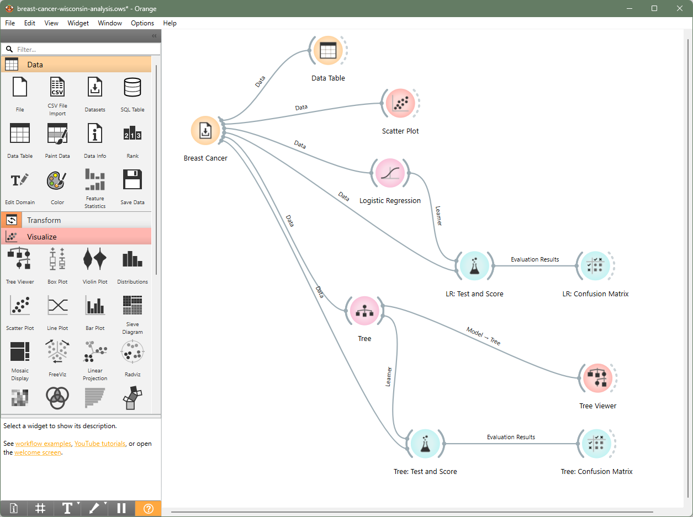

# 🩺 Mini-proyecto 1: Clasificación de tumores (Breast Cancer Wisconsin)

Este mini-proyecto tiene como objetivo introducir el concepto de **clasificación supervisada** en IA usando datos clínicos reales sobre tumores. El objetivo es que la IA aprenda a **predecir si un tumor es benigno o maligno** a partir de las características celulares medidas en laboratorio.

## 🎯 ¿Qué aprenderás?

- Cómo cargar y explorar un dataset médico
- Cómo entrenar modelos clasificadores (árbol de decisión, regresión logística…)
- Cómo comparar su rendimiento
- Cómo interpretar resultados con una matriz de confusión


## 🧭 Pasos en Orange

### 1. Abrir Orange y añadir el dataset

1. Abre Orange.
2. Añade el widget `Datasets` desde la sección “Data”.
3. Haz doble clic en el widget y selecciona el dataset llamado:  
   **`Breast Cancer Wisconsin`**.
4. Conéctalo a un `Data Table` para visualizar los datos.


### 2. Explorar las características visualmente

1. Añade un widget `Scatter Plot`.
2. Conecta `Datasets → Scatter Plot`.
3. En el eje X e Y, selecciona distintas variables (como `Clump Thickness` y `Uniform Cell Size`).
4. Usa el color por clase (`Class`) para ver la separación entre tumores **benignos** y **malignos**.


### 3. Preparar los modelos de clasificación

1. Añade los siguientes widgets desde la sección “Model”:
   - `Tree`
   - `Logistic Regression`
2. Conecta el dataset a cada uno:
```
Dataset → Tree
Dataset → Logistic Regression
```
Prueba otros modelos si te apetece (e.g. Random Forest)

### 4. Evaluar los modelos

1. Añade el widget `Test & Score`.
2. Conecta los dos modelos al `Test & Score`. O cada modelo al `Test & Score`
3. Abre el widget y observa métricas como:
- Accuracy
- AUC
- F1 Score

### 5. Ver errores del modelo

1. Añade el widget `Confusion Matrix`.
2. Conecta `Test & Score → Confusion Matrix`.
3. Elige uno de los modelos para ver los aciertos y errores del clasificador.

### 6. (Opcional) Ver cómo “piensa” un árbol

1. Añade el widget `Tree Viewer`.
2. Conecta `Tree → Tree Viewer`.
3. Abre el árbol para ver qué decisiones toma la IA (por ejemplo, “si Clump Thickness > 4.5, entonces…”)

## 🧪 Reflexión

- ¿Qué variables parecen más importantes?
- ¿Todos los modelos clasifican igual?
- ¿Dónde se equivoca la IA?

## 🧩 Resultado esperado

Este es el flujo final que deberías tener construido en Orange:




## 📝 Créditos del dataset

- **Nombre:** Breast Cancer Wisconsin (Diagnostic)
- **Fuente:** UCI Machine Learning Repository
- **Descripción:** Características medidas en células obtenidas por aspiración con aguja fina de masas mamarias. Clasificadas como benignas o malignas.


